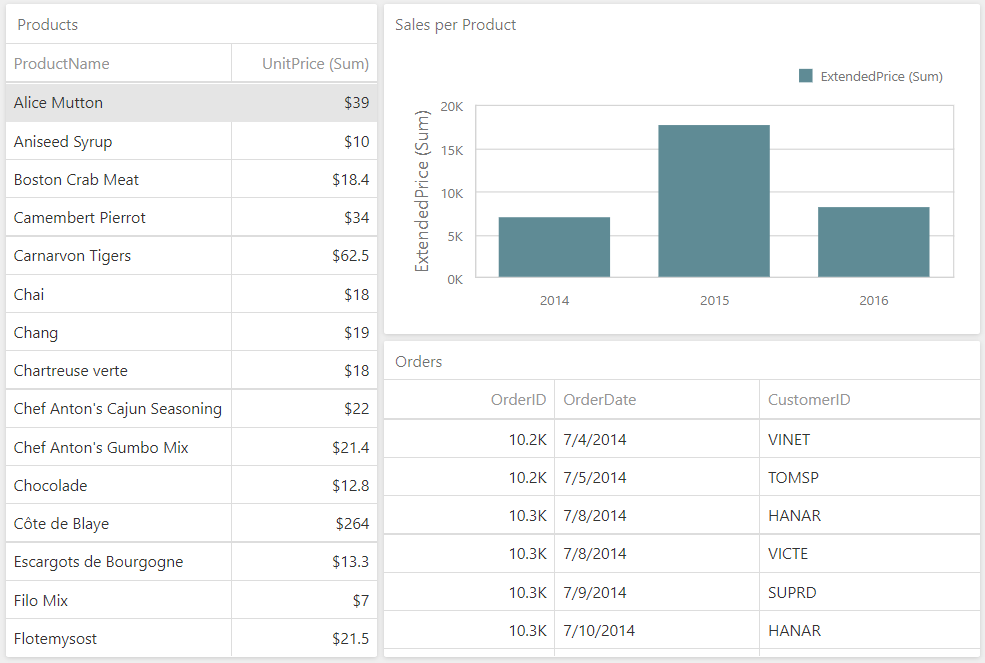

<!-- default badges list -->

<!-- default badges end -->
# Dashboard for ASP.NET Core - How to Use Parameters to Update a Specific Dashboard Item Without Refreshing the Entire Dashboard

The example shows how to use dashboard parameters to update a specific dashboard item without refreshing the entire dashboard. This technique applies when you need to filter a data source's data to update a specific dashboard item, but do not want to refresh data in all items in a dashboard because this operation causes a performance delay.

The dashboard in the example has three items: 
- The "Products" grid
- The "Sales per Product" chart
- The "Orders" grid

All items are bound to different data sources. The "Products" grid item [filters](https://docs.devexpress.com/Dashboard/117060/web-dashboard/create-dashboards-on-the-web/interactivity/master-filtering) the "Sales per Product" chart values. 

The selected master filter value is obtained on the client. The [headers](https://docs.devexpress.com/Dashboard/js-DevExpress.Dashboard.AjaxRemoteService#js_devexpress_dashboard_ajaxremoteservice_headers) property is used to pass the value to the server and change the parameter to filter the chart's data source. The [DashboardControl.refresh](https://docs.devexpress.com/Dashboard/js-DevExpress.Dashboard.DashboardControl?p=netframework#js_devexpress_dashboard_dashboardcontrol_refresh) method updates the chart item on the client side.

## Files to Review

* [Index.cshtml](./CS/AspNetCoreDashboard/Pages/Index.cshtml)
* [DashboardUtils.cs](./CS/AspNetCoreDashboard/Code/DashboardUtils.cs#L18-L22)
* [script.js](./CS/AspNetCoreDashboard/wwwroot/js/script.js)

## Documentation

- [Master Filtering](https://docs.devexpress.com/Dashboard/117060/web-dashboard/create-dashboards-on-the-web/interactivity/master-filtering)
- [Manage an In-Memory Data Cache](https://docs.devexpress.com/Dashboard/400983/web-dashboard/dashboard-backend/manage-an-in-memory-data-cache)
- [Dashboard Parameters](https://docs.devexpress.com/Dashboard/117062/web-dashboard/create-dashboards-on-the-web/data-analysis/dashboard-parameters)

## More Examples

- [Dashboard for ASP.NET Core - How to Reset the Data Source Cache](https://github.com/DevExpress-Examples/aspnet-core-dashboard-use-different-caches)
- [Dashboard for MVC - How to Reset the Data Source Cache](https://github.com/DevExpress-Examples/mvc-dashboard-use-different-caches)
- [Dashboard for Web Forms - How to Reset the Data Source Cache](https://github.com/DevExpress-Examples/web-forms-dashboard-use-different-caches)
<!-- feedback -->
## Does this example address your development requirements/objectives?

 

(you will be redirected to DevExpress.com to submit your response)
<!-- feedback end -->
